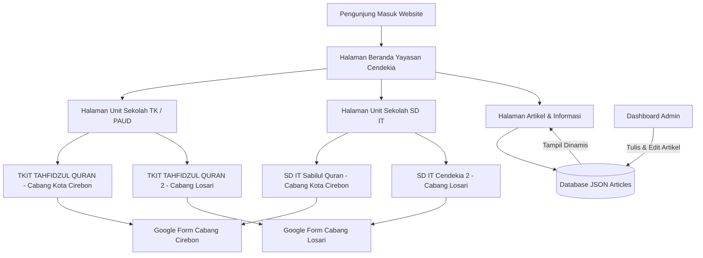

# Petunjuk Import Flow ke Excalidraw (Hanya TK & SD Tersedia)

Gunakan kode Mermaid berikut untuk membuat diagram alur di **Excalidraw** yang mencerminkan kondisi saat ini (hanya jenjang TK & SD yang tersedia, serta pemisahan Google Form per cabang).

---

## 1. Salin Kode Mermaid Berikut:

---

## 2. Cara Mengimpor di Excalidraw:

1. Buka [**Excalidraw**](https://excalidraw.com/) di browser Anda.
2. Klik ikon **More Tools** (ikon 3 titik atau kubus) di toolbar -> pilih **Mermaid**.
3. Hapus kode contoh bawaan, lalu **paste** kode di atas.
4. Klik **Insert** untuk me-render kotak dan panah alur secara otomatis ke kanvas.
